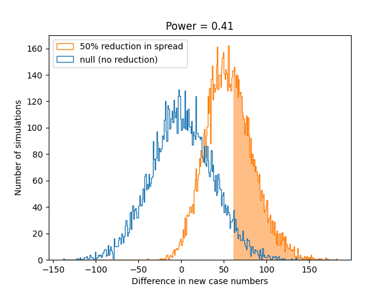
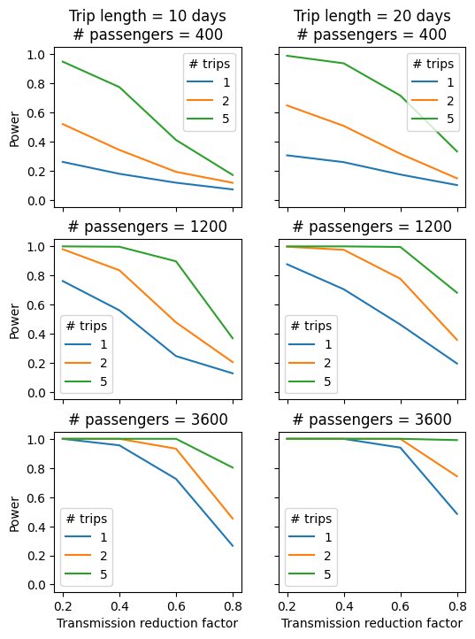
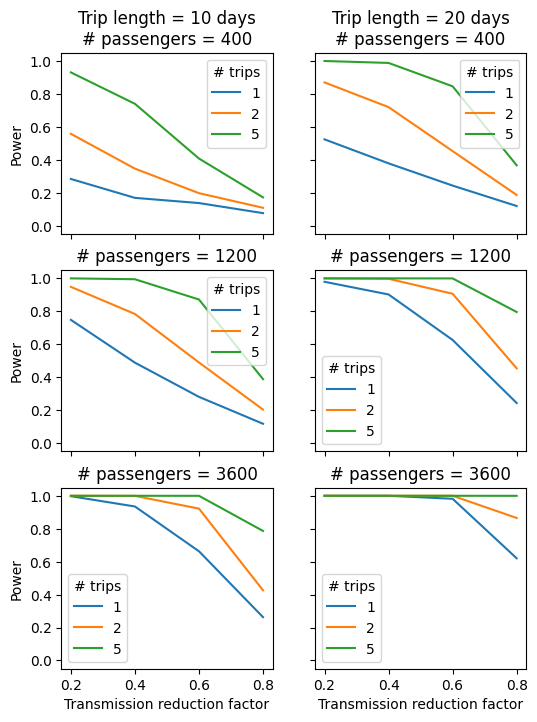
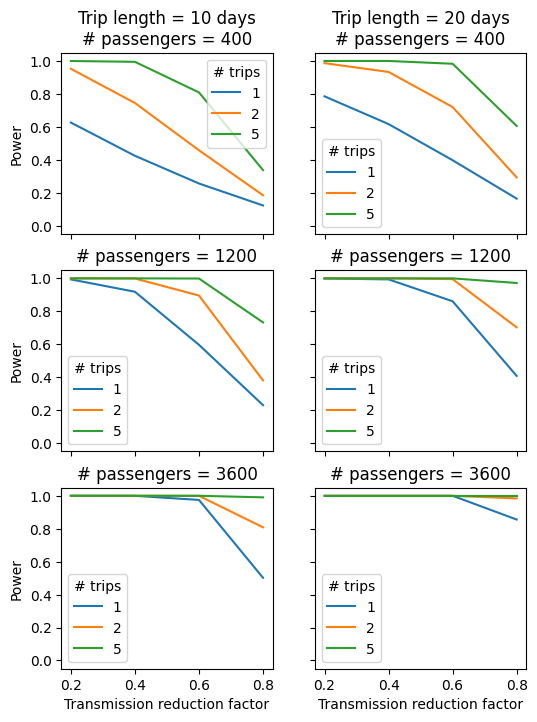
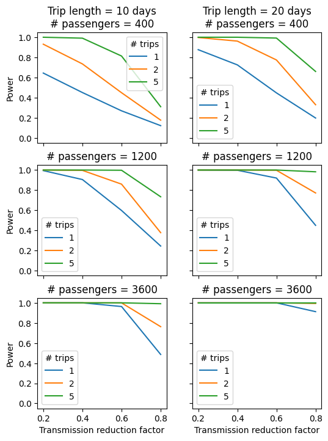

# Cruise UV Power Analysis
Dan Rice

March 2023

## Background

SecureBio is considering a proposal to the CDC to fund a trial of the efficacy of far UV-C lights for reducing respiratory disease spread on cruise ships.
The basic plan is to install UV-C lamps in all the public spaces on one ship and placebo lights on another and collect nasal swabs from passengers daily.
After the cruise the samples will be tested for a panel of respiratory virus.
The purpose of this repo is to do rough order-of-magnitude power analysis for the proposed study.
We're interested in how the power to detect an effect of UV on viral transmission depends on things like:
1. The efficacy of the lamps
1. The prevalence of viruses at the time of the cruise
2. The number of passengers
3. The length of the cruise
4. The degree of isolation from non-passengers during the cruise

## Model

### Viral transmission

Because we are interested in a relatively short period of time, it is important to consider the timecourse of each infection.
Therefore, we use an age-structured model that keeps track of the number of infected people as a function of how long ago they were first infected.
We specify the infectious period of the virus with four parameters:

- $T_1$, the time (in days) between when a person contracts the virus and when they become infectious
- $T_2$, the time between when a person contracts the virus and when they stop being infectious
- $c$, the number of contacts per day that an infectious person has with succeptipble people. (Note that we assume that this number is constant in time and independent of the number of people currently infected.)
- $p$, the probability that a contact between an infectious and non-infected person leads to a new infection

The expected number of people a single infected person is expected to infect before they recover is given by, $R_0 = pc(T_2 - T_1)$.

We model the effect of UV lamps as a reduction in $p$ by a multiplicative factor $f \in (0, 1)$.
We do not, at present, model contacts in public and private areas separately, nor do we model an explicit contact network on the ship.
Instead, we assume treat these effects in a coarse-grained way through $f$.

### Infections over time

The cruise has $N$ passengers and last for $T_c$ days.
We assume that the virus is at prevalence $\lambda_0$ in the population the cruise ship passengers come from.
We initialize the number of individuals who were infected $0 \leq \tau < T_2$ days ago by drawing independent Poisson random variables according to:
$$i_{\tau}(0) \sim Poisson(\frac{N \lambda_0}{T_2}).$$

For each day of the cruise, we simulate new infections according to
$$i_0(t) \sim Poisson(\lambda_{outside} + cpf \sum_{\tau = T_1}^{T_2 - 1} i_\tau(t-1))$$.
where $\lambda_{outside}$ is the expected number of new infections from interactions without people outside the cruise.

We also increment the age of all the other infections:
$$i_{\tau}(t) = i_{\tau - 1}(t - 1)$$
for $\tau > 0$.

### Measurements

We assume that every person on the cruise gives a sample once per day and that the samples are tested for a panel of respiratory viruses.
We do not explicitly model multiple viruses and instead treat them all together, so that the number infected represents those infected with any virus.
In doing so, we assume that all of the viruses have similar $R_0$, $T_1$, $T_2$, etc.

Infections are undetectable for a period of time from infection until $T_{+}$ days later, at which point they are detected deterministically by our test.
In practice, we have been assuming that $T_{+} = T_1$, the latent period before infectiousness.

We thus define the new measured infections on day $t$ to be:
$$m(t) = i_{T_{+}}(t)$$
And the total new infections over the course of the cruise to be:
$$M = \sum_{t = 1}^{T_c} m(t)$$.

### Statistics and power analysis

To determine our power to detect an effect of the lamps, we construct a simple null-hypothesis test.
For each ship, we count the total number of new infections measured over the course of the cruise (and over all trips if there are multiple), $M$ as defined above.
Our test statistic is the difference, $D = M_{control} - M_{UV}$, in new infections between the control ship and the UV-equipped ship.

To estimate the null distribution of the test statistic, we sample pairs of simulated control ships and calculate the difference in new infections between the two samples.
We use the null distribution to calculate the threshold difference in infections so that $P_{null}[D > D_{thresh}] = \alpha$ with significance level $\alpha = 0.05$.

Finally, we estimate power by simulating $D$ in a large number of control/UV-equipped pairs.
Using this simulated distribution, we calculate $power = P[D > D_{thresh}]$.

This figure illustrates the power calculation.
The blue histogram gives the null distribution of the test statistic, comparing control/control pairs.
The orange histogram shows the distribution comparing control/UV pairs.
The shaded area is the portion of the distribution above $D_{thresh}$.

### Limitations

- No overdispersion in infections
- No heterogeneity of infections
- Only one set of viral parameters representing multiple viruses
- Test statistic is just difference in counts, but we'd do something more sophisticated in practice
- Bulk model of the passengers: no structure to interactions, no explicit public/private space contacts
- Assumes parameters are known and constant
- Number of contacts per person per day independent of the number of passengers on the ship (alternatively it could scale linearly or sublinearly)
- Everyone is tested every day

## Results

This section shows a number of plots of estimated power as a function of the transmission reduction factor of the UV lamps, $f$.
We vary the trip length, the number of passengers, the number of trips per ship, the prevalence of the virus, and the degree of outside contact.

The following parameters are constant across all simulations:
| Parameter | Value |
|-----------|-------|
| $T_1$ | 2 |
| $T_2$ | 12 |
| $T_{+}$ | 2 |
| $R_0$ | 1.3 |

The product of $p$ and $c$ is determined from the other parameters.

### Lower prevalence / no outside contact

Viral prevalence = 0.04 per person

Rate of new cases from outside the ship = 0

### Lower prevalence / some outside contact

Viral prevalence = 0.04 per person

Rate of new cases from outside the ship = 1 per 400 people per day

### Higher prevalence / no outside contact

Viral prevalence = 0.1 per person

Rate of new cases from outside the ship = 0

### Higher prevalence / some outside contact

Viral prevalence = 0.1 per person

Rate of new cases from outside the ship = 1 per 400 people per day

## Conclusions

- The short trips with few people are underpowered
- Outside contacts (at least at the rate tested) do not effect the power much at all
- Power is very sensitive to the initial number of infected people (through the number of passengers and the viral prevalence).
- We likely would need to test a large ship, ideally over multiple cruises.
- We might be able to extract more value using better statistics, but we've also made some optimistic simplifying assumptions, so I would take these as upper-bound estimates of the power.
